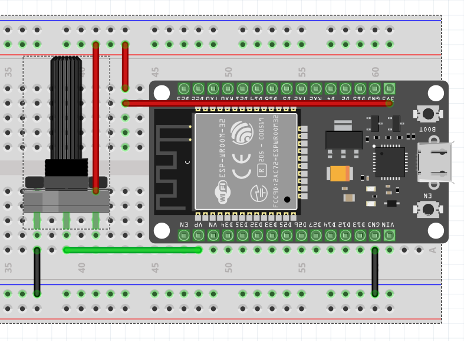

# ADC Reading program

Con este programa aprenderemos a leer una entrada de tipo análoga y convertirla a un valor digital. Conecta un potenciometro al pin 36 del ESP32 como se muestra en la imágen.

## Ejercicio 1.
Crea un programa para leer dos entradas analógicas al mismo tiempo.

