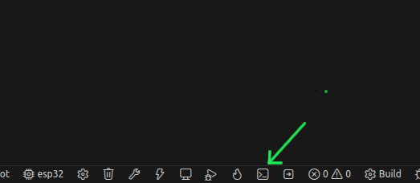
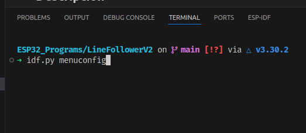
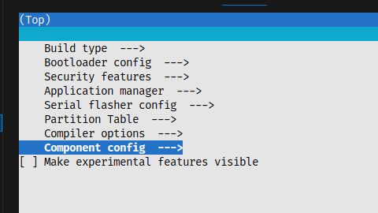
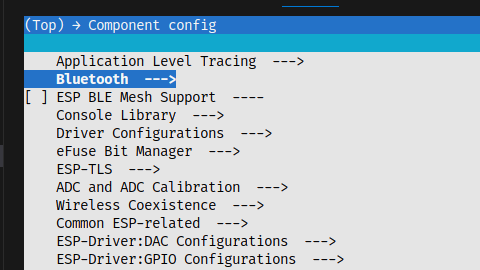
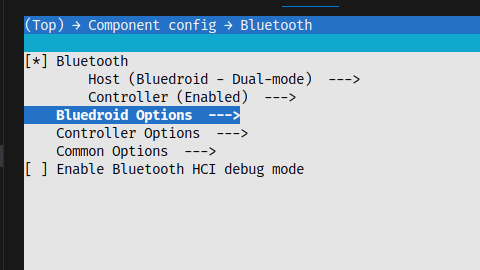
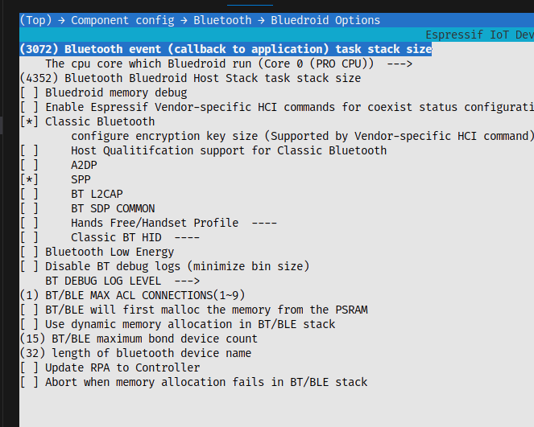
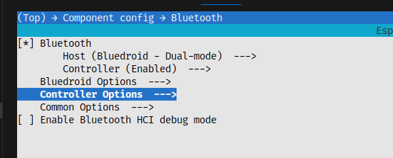
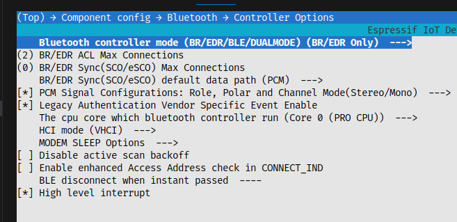
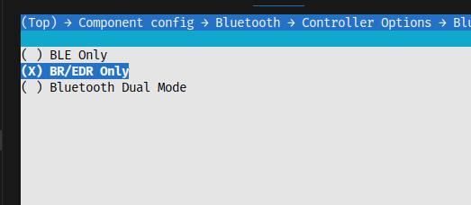

# Imágenes del Proyecto - LineFollowerV2

Esta carpeta contiene las imágenes relacionadas con la configuración y uso de la comunicación Bluetooth del proyecto LineFollowerV2.

## Configuración Bluetooth

### Sigue los pasos según las imagenes.

Abre el idf terminal

Teclea el comando idf.py menuconfig 

Ingresa a Component config --> usando las flechas

Ingresa a Bluetooth 

Ingresa a Bluedroid Options 

Activa las casillas según la imagen 

Con flecha atras regresa e ingresa a controller options

Ingresa a Bluetooth Controller mode

Activa BR/EDR Only

Para finalizar presiona "Q" y luego "Y"